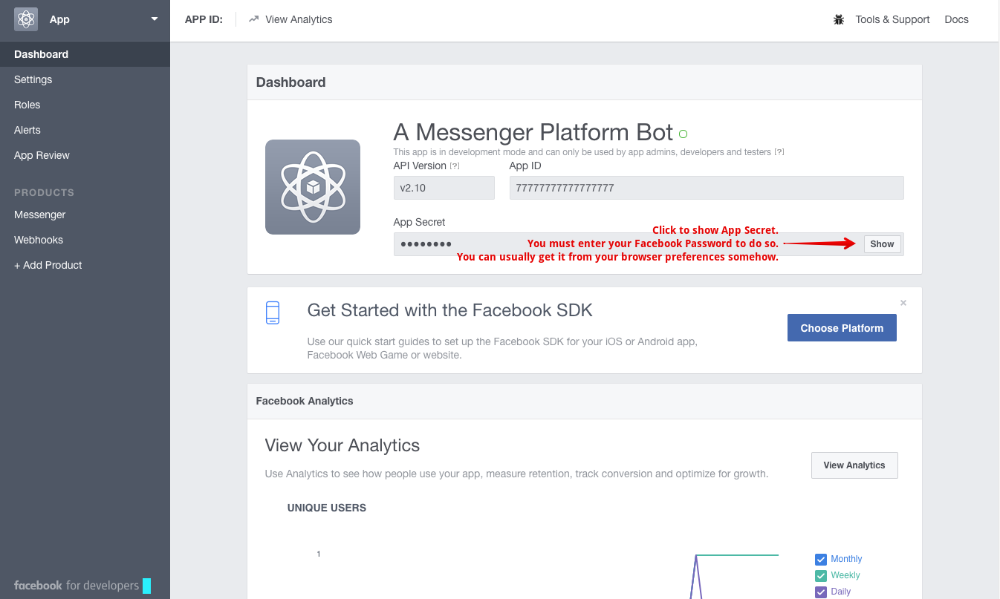
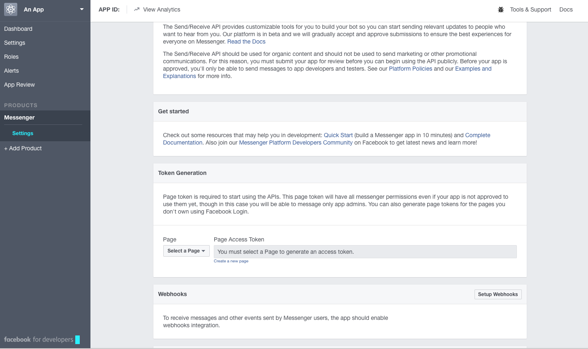
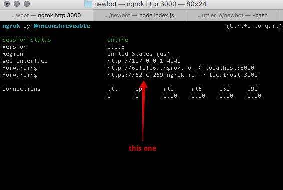
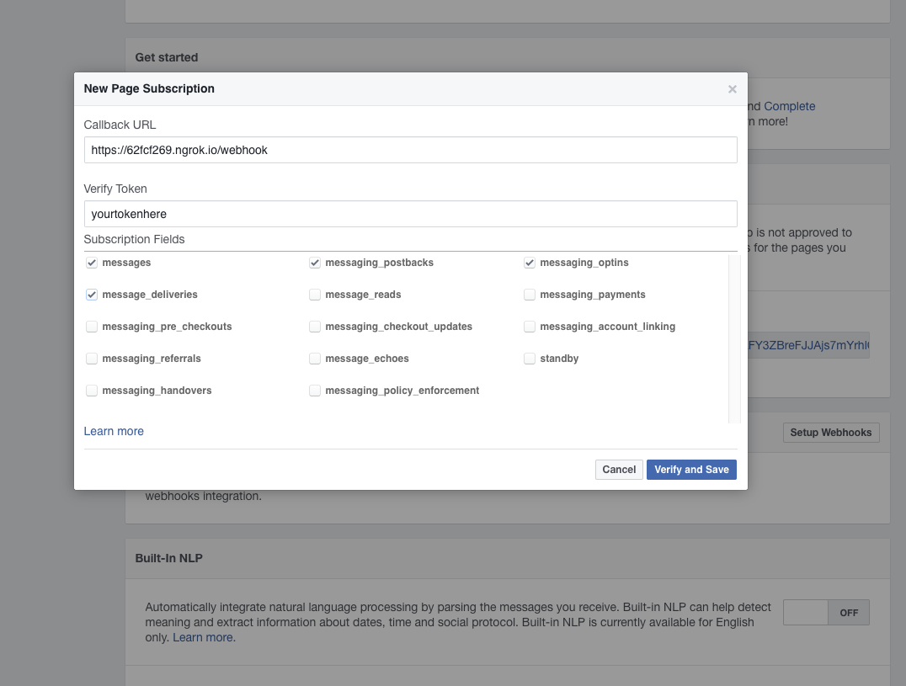

# A Test Bot based on Bootbot

## Run this App

*** Prerequisites:
- A Facebook Page
- Current Node JS version (which includes npm)
- A decent terminal app like Cygwin or git-bash. I don't think Windows commands work.

### Initial setup: Generate an environment
1. Open Terminal.
2. Clone the repo to your computer.
3. Run `npm i` to install all of the dependencies.
4. run `cp .env.example .env` to make a `.env` file from the example one.
5. Open your `.env` file.

### Second part: Make an app for your Facebook Page
1. Make sure you've created a Facebook Page.
2. Go to [this link](https://developers.facebook.com/apps/) and create a new app.
3. Create an app for **Messenger**

### Third Part: Adding the App Secret and Page Access Token
1. In the nav menu, click **Dashboard** and show your app secret

2. Copy/paste the app secret as the `APP SECRET` line in the `.env` file
3. Click over to **Messenger** and look for **Token Generation** and **Webhooks**

4. In **Token Generation** Select your page, click through the prompts, generate a token
5. Copy/paste the token in the `PAGE_ACCESS_TOKEN` in the `.env` file

## All right, here's the trickiest part

1. In your terminal, run `npm i -g ngrok` to make sure you have the most recent version of ngrok.
2. Run `ngrok http 3000`
3. Copy the **https URL**, which is something like `https://62fcf269.ngrok.io`.

4.  Paste the URL into the **Callback URL** field, followed by `/webhook` so it looks like `https://62fcf269.ngrok.io/webhook`
)
5. Enter a verify token.

6. Copy/Paste the token in the `VERIFY_TOKEN` field in the `.env` file
7. In a new terminal tab or window run `node index.js`
8. Check the boxes for **messages**, **messaging_postbacks**, **messaging_optins**, **message_deliveries**
9. Verify and save.
10. Subscribe your app to your page's events.

That should work. Start chatting with your page.