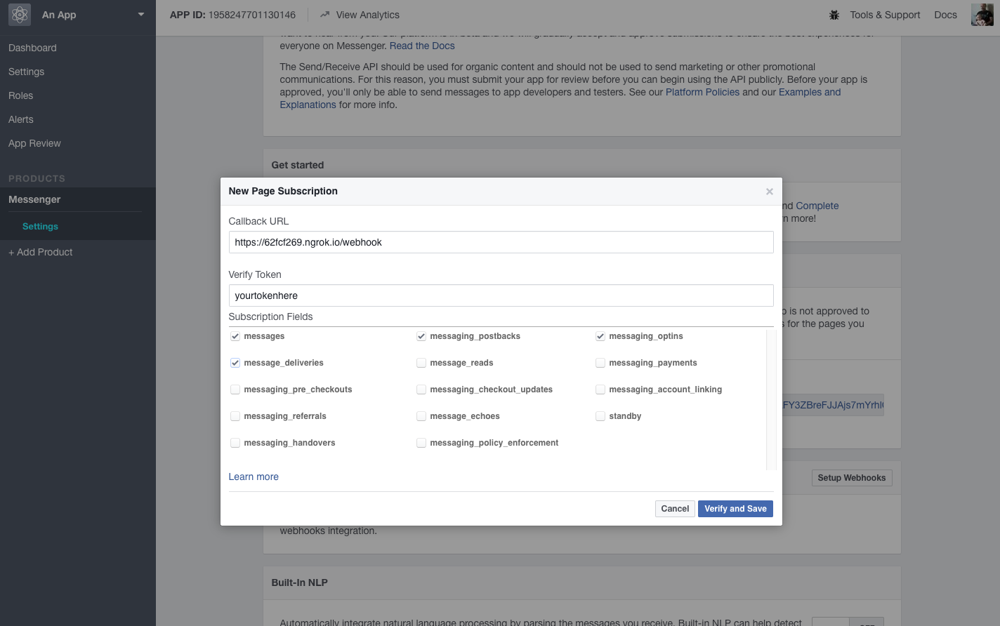

# TestBot - A test bot based on BootBot

This is a node application that uses the BootBot framework to make a 

## Run this App

### Prerequisites

- A Facebook Page
- Current Node JS version (which includes npm)
- A decent terminal app like Terminal for OSX, Cygwin or git-bash. I don't think Windows commands work.

### Initial setup: Generate an environment

1. Open Terminal.
1. Clone the repo to your computer.
1. Run `npm i` to install all of the dependencies.
1. Run `cp .env.example .env` to make a `.env` file by copying the example.
1. Open your `.env` file.

### Second part: Make an app for your Facebook Page

1. Make sure you've created a Facebook Page.
1. Go to [this link](https://developers.facebook.com/apps/) and create a new app.
1. Create an app for **Messenger**

### Third Part: Adding the App Secret and Page Access Token

1. In the nav menu, click **Dashboard** and show your app secret

1. Copy/paste the app secret as the `APP SECRET` line in the `.env` file
1. Click over to **Messenger** and look for **Token Generation** and **Webhooks**

1. In **Token Generation** Select your page, click through the prompts, generate a token
1. Copy/paste the token in the `PAGE_ACCESS_TOKEN` in the `.env` file

### All right, here's the trickiest part

1. In your terminal, run `npm i -g ngrok` to make sure you have the most recent version of ngrok, which will allow Facebook to access your local host for as long as ngrok is running.
1. Run `ngrok http 3000`
1. Copy the **https URL**, which is something like `https://62fcf269.ngrok.io`.

1.  Paste the URL into the **Callback URL** field, followed by `/webhook` so it looks like `https://62fcf269.ngrok.io/webhook`

1. Enter a verify token.

1. Copy/Paste the token in the `VERIFY_TOKEN` field in the `.env` file
1. In a new terminal tab or window run `node index.js`
1. Check the boxes for **messages**, **messaging_postbacks**, **messaging_optins**, **message_deliveries**
1. Click **Verify and save**.
1. Subscribe your app to your page's events.

**Notes**
 - Important: If you close down ngrok you'll need to reset your webhook your webhook will die.
 - If your webhook dies, you'll need to set a new one up
 - To set up a new webhook, use the **Webhooks** link under the Products header and use the **Edit Subscription** button to reset your webhook

### Develop that bot

In your terminal, run `npm i -g nodemon`. Nodemon allows you to see changes to your local development copy on your machine, whereas `node index.js` doesn't watch for changes automatically.

When you go to boot up your bot to work on development, run 'nodemon' in the root directory. It will automatically grab index.js and start rolling. Whenever you save, nodemon will reboot the app with your changes, which typically takes up to one second to take effect.

